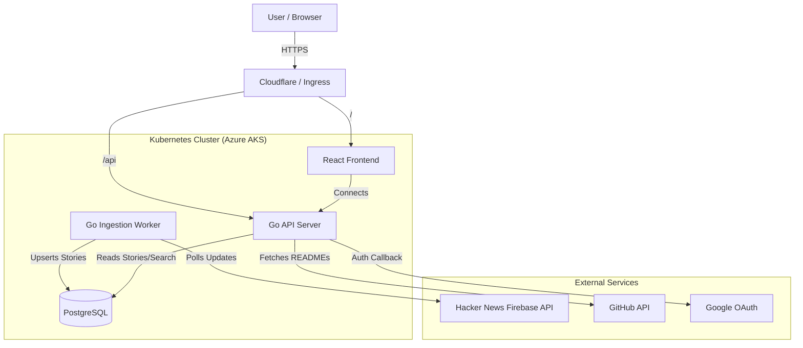

# Hacker News Station

[](https://go.dev)
[](https://react.dev)
[](https://typescriptlang.org)
[](https://postgresql.org)
[](https://kubernetes.io)
[](https://docker.com)
[](https://tailwindcss.com)
[](https://hnstation.dev)

A modern, fast, and feature-rich Hacker News client built with Go and React.


## Features

- **Real-time Updates**: Stories are fetched every minute to keep content fresh.
- **Accurate Ranking**: "Front Page" algorithm mirrors HN exactly, clearing old ranks automatically.
- **Modern UI**: sleek dark mode (`bg-[#111827]`) with no white edges and a 3-column layout.
- **Comments Sidebar**: Read comments inline in a dedicated right sidebar with recursive threading.
- **Topic Filtering**: Filter stories by popular topics like *Postgres, LLM, Rust, Go, AI*.
- **Custom Topics**: Add and remove your own topics, persisted via local storage.
- **Search**: Full-text search powered by PostgreSQL `tsvector`.
- **Dockerized**: Easy setup with Docker Compose.

## Tech Stack

- **Backend**: Go (Golang) with `chi` router.
- **Database**: PostgreSQL with `pgx`.
- **Frontend**: React, TypeScript, Tailwind CSS, Vite.
- **Ingestion**: Custom Go worker pool fetching from HN Firebase API.

## Getting Started

### Prerequisites

- Docker and Docker Compose

### Running the Application

1. Clone the repository.
2. Start the services:

```bash
docker-compose up --build
```
3. Open http://localhost:3000 in your browser.

## Architecture

- **Ingestion Service**: Fetches top stories and comments from HN API, processes them, and stores them in Postgres.
- **API Server**: Serves stories and comments via REST endpoints (`/api/stories`, `/api/stories/{id}`).
- **Frontend**: A responsive single-page application consuming the API.

## System Architecture



## Recent Updates

- **Phase 30**: AKS Deployment Stability — PGVector support (`000007_add_vectors`), correct secret management (`secrets.yaml` with base64 encoded credentials), and robust ingestion restart policy.
- **Phase 29**: High-Density UI & AI Features — Compact, single-line story list for maximum information density (15+ visible items). AI-powered Thread Summarization (`s` key). Enhanced keyboard navigation (`Left`/`Right` to collapse/expand, `Ctrl+Left` to focus list, `Del` to hide story). Visual cursor improvements.
- **Phase 27**: Collapsible threaded comments (click-to-collapse header row, descendant count), GitHub iframe fix (redirects to Readme tab), prose-invert comment styling.
- **Phase 26**: Site favicons in StoryCard (Google Favicons API), dark mode scrollbars (8px, slate-themed, Firefox support), reader typography (Merriweather font, `prose-invert`, `max-w-3xl` constraint), `@tailwindcss/typography` plugin.
- **Phase 25**: GitHub-style navigation tabs with icons (TrendingUp, Clock, Trophy, Monitor, Bookmark), quick filter chips (Postgres/Rust/AI/LLM/Go), visual de-congestion with `h-16` header, `space-y-3` story gaps, and `p-4` card padding.
- **Phase 24**: Readme Viewer — tabbed reader pane (Discussion/Readme/Article), backend GitHub README proxy (`/api/content/readme`), auto-switches to Readme for Show HN + GitHub stories, rendered with `react-markdown` + `rehype-highlight`.
- **Phase 23**: Keyboard navigation refinements — header focus mode, arrow key pill navigation, PageUp/PageDown for 5-story jumps, compact story layout, stronger zebra striping.
- **Phase 22**: User interactions — bookmarks (save/unsave with star icon), read history tracking, `user_interactions` table with composite PK, optimistic UI updates, "Bookmarks" mode.
- **Phase 21**: Google OAuth login with JWT sessions, user avatars, `is_admin` column for future admin panel. Site fully usable without login.
- **Phase 19**: Zen Mode 2-pane layout (feed + reader), Article/Discussion tabs with iframe preview.
- **Phase 18**: Resizable 3-pane IDE layout with `react-resizable-panels`, persistent sizing, and Space/Esc keyboard shortcuts.
- **Phase 17**: Header redesign, simplified navigation, and data cleanup.
- **Phase 16**: Visual polish (bold selection) and full keyboard accessibility (Tab/Enter).
- **Phase 15**: Layout density, centered header, and arrow-key navigation.
- **Phase 11-14**: Dark focus, Glassmorphism UI, and compact list design.
- **Phase 10**: Enterprise Security with Azure Key Vault & Managed Identity (Secrets Store CSI).
- **Phase 9**: Production Ingress with Let's Encrypt TLS (https://hnstation.dev).
- **Phase 8**: AKS Deployment, Ranking Consistency Fixes (Atomic Updates), and Ingestion improvements.
- **Phase 7**: Sidebar visual enhancements (contrast) and custom topic management.
